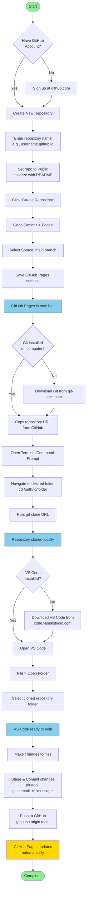

## Visual Journey

This visual help remind me of Tools and their relationship to my Development Journey. 

```mermaid
flowchart TD
    Start([Start]) --> CreateAccount{Have GitHub<br/>Account?}
    CreateAccount -->|No| SignUp[Sign up at github.com]
    CreateAccount -->|Yes| CreateARepo[Create New Repository]
    SignUp --> CreateARepo

    CreateARepo --> RepoName[Enter repository name<br/>e.g., username.github.io]
    RepoName --> RepoSettings[Set repo to Public<br/>Initialize with README]
    RepoSettings --> CreateButton[Click 'Create Repository']

    CreateButton --> EnablePages[Go to Settings > Pages]
    EnablePages --> SelectSource[Select Source: main branch]
    SelectSource --> SavePages[Save GitHub Pages settings]
    SavePages --> PagesEnabled[GitHub Pages is now live!]

    PagesEnabled --> InstallGit{Git installed<br/>on computer?}
    InstallGit -->|No| DownloadGit[Download Git from git-scm.com]
    InstallGit -->|Yes| CopyURL
    DownloadGit --> CopyURL[Copy repository URL<br/>from GitHub]

    CopyURL --> OpenTerminal[Open Terminal/Command Prompt]
    OpenTerminal --> Navigate[Navigate to desired folder<br/>cd /path/to/folder]
    Navigate --> Clone[Run: git clone URL]
    Clone --> CloneComplete[Repository cloned locally]

    CloneComplete --> InstallVSCode{VS Code<br/>installed?}
    InstallVSCode -->|No| DownloadVSCode[Download VS Code from<br/>code.visualstudio.com]
    InstallVSCode -->|Yes| OpenVSCode
    DownloadVSCode --> OpenVSCode[Open VS Code]

    OpenVSCode --> OpenFolder[File > Open Folder]
    OpenFolder --> SelectCloned[Select cloned repository folder]
    SelectCloned --> VSCodeReady[VS Code ready to edit!]
    VSCodeReady --> MakeChanges[Make changes to files]
    MakeChanges --> GitCommit[Stage & Commit changes<br/>git add .<br/>git commit -m 'message']
    GitCommit --> GitPush[Push to GitHub<br/>git push origin main]
    GitPush --> PagesUpdate[GitHub Pages updates<br/>automatically]
    PagesUpdate --> End([Complete!])

    style Start fill:#90EE90
    style End fill:#90EE90
    style PagesEnabled fill:#87CEEB
    style CloneComplete fill:#87CEEB
    style VSCodeReady fill:#87CEEB
    style PagesUpdate fill:#FFD700
```